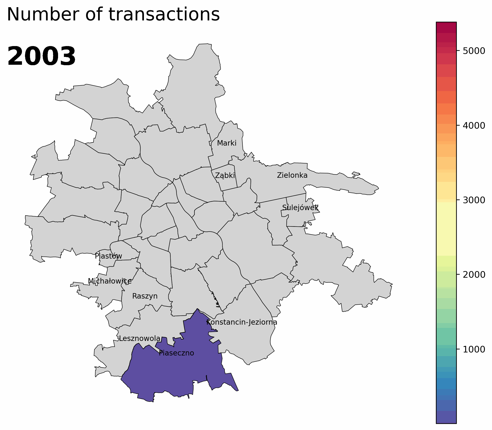

## Analyzing Polish land plot and transaction data

#### Goal: 
for now: get an initial understanding on the Polish property market, with the focus on land properties

#### Data:
- Polish public distirict data (pl.Dane powiatowe - działki ewidencyjne oraz transakcje) in .parquet for Masovian Voivodeship; link: https://www.geoportal.gov.pl/aktualnosci/nowa-usluga-dane-powiatowe-dostepna-w-serwisie-www-geoportal-gov-pl/?utm_source=chatgpt.com 
- Polish DB of topographical objects BDOT10k in .gpkg for Masovian Voivodeship; link: https://www.geoportal.gov.pl/pl/dane/baza-danych-obiektow-topograficznych-bdot10k/

Both datasets were downloaded on 31 January 2026.