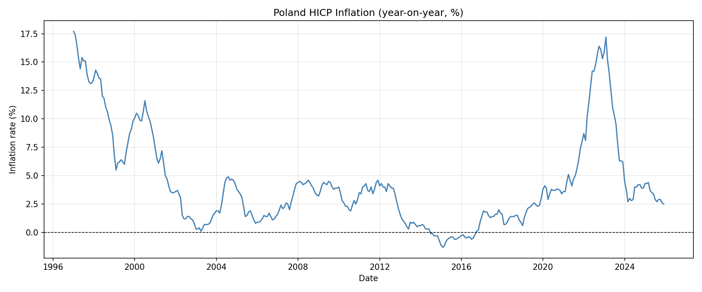

# price_data

Scripts for downloading, cleaning, and storing Polish real estate transaction and inflation data.

## Modules

### `rcn_pipeline.py` — `RCNTransactionPipeline`

Downloads property transaction records from the [RCN WFS service](https://mapy.geoportal.gov.pl/wss/service/rcn), cleans and preprocesses them, and saves to DuckDB and/or GeoParquet.

On initialisation the pipeline automatically runs `InflationDataDownloader` to ensure `inflation.csv` is up-to-date. The baseline year and month used for HICP rebasing are written to the log.

Available WFS layers:

| Constant | Layer | Description |
|---|---|---|
| `LAYER_LOKALE` | `ms:lokale` | Apartments / local units |
| `LAYER_BUDYNKI` | `ms:budynki` | Buildings |
| `LAYER_DZIALKI` | `ms:dzialki` | Land parcels |
| `LAYER_POWIATY` | `ms:powiaty` | Counties (admin units) |

Pipeline steps (called by `run()`):

1. `_refresh_inflation()` — updates `inflation.csv` and loads HICP data into memory
2. `connect()` — connects to the WFS endpoint
3. `download()` — fetches features for the given layer and bounding box
4. `clean()` — drops nulls, removes zero-price records, IQR-based outlier removal (3×IQR)
5. `preprocess()` — creates `transaction_id`, parses `dok_data`, computes `price_per_sqm`, adds inflation-normalised columns, adds `lon`/`lat`, reprojects to `target_crs`
6. `save()` — upserts into DuckDB table and/or appends to GeoParquet (deduplication by `transaction_id`)

Key parameters:

| Parameter | Default | Description |
|---|---|---|
| `layer` | `ms:lokale` | WFS layer to download |
| `bbox` | Wilanów district | `(lat_min, lon_min, lat_max, lon_max)` in EPSG:4326 |
| `max_features` | `None` | Cap on features per request |
| `target_crs` | `EPSG:2180` | Output CRS for geometry |
| `save_format` | `"duckdb"` | `"duckdb"`, `"geoparquet"`, or `"both"` |
| `db_path` | `None` | Required when saving to DuckDB |
| `parquet_path` | `None` | Required when saving to GeoParquet |
| `process_data` | `True` | Whether to run `clean()` and `preprocess()` |
| `inflation_csv_path` | `"price_data/inflation.csv"` | Path to the HICP inflation CSV |

### `inflation_downloader.py` — `InflationDataDownloader`

Downloads Polish HICP inflation data (all-items, `CP00`) from the [Eurostat API](https://ec.europa.eu/eurostat/api/dissemination/statistics/1.0/data) and saves it as a CSV. Incremental — only fetches months not yet present in the existing file. Also computes `hicp_rebased`, which re-anchors the index to a configurable baseline month (default: January 2025 = 100).

Output columns:

| Column | Description |
|---|---|
| `year` | Year |
| `month` | Month |
| `inflation_value` | Year-on-year HICP rate (%) |
| `hicp_index` | HICP index (Eurostat base: 2015 = 100) |
| `hicp_rebased` | HICP index rebased to `baseline_year`/`baseline_month` = 100 |

Key parameters:

| Parameter | Default | Description |
|---|---|---|
| `csv_path` | `"price_data/inflation.csv"` | Output CSV path |
| `start_date` | `"1990-01"` | Earliest period to fetch |
| `baseline_year` | `2025` | Reference year for `hicp_rebased` |
| `baseline_month` | `1` | Reference month for `hicp_rebased` |

### `utils.py`

`setup_file_logger(logger, class_name)` — attaches a file handler to a logger, writing to `<project_root>/logs/{ClassName}_{YYYYMMDD_HHMMSS}.log`.

## Setup

```bash
conda env create -f price_data/env.yml
conda activate dev
```

## Usage

Run the transaction pipeline directly (defaults to Wilanów apartments, saves to `lokale_wilanow.duckdb` and `lokale_wilanow.parquet`):

```bash
python price_data/rcn_pipeline.py
```

Run the inflation downloader standalone:

```bash
python price_data/inflation_downloader.py
```

Or configure and run from a script/notebook:

```python
from price_data.rcn_pipeline import RCNTransactionPipeline

pipeline = RCNTransactionPipeline(
    layer="ms:lokale",
    bbox=(52.155, 21.055, 52.200, 21.130),  # (lat_min, lon_min, lat_max, lon_max)
    save_format="both",
    db_path="plots_poland.duckdb",
    parquet_path="lokale_wilanow.parquet",
)
pipeline.run()
```

```python
from price_data.inflation_downloader import InflationDataDownloader

InflationDataDownloader(csv_path="price_data/inflation.csv").run()
```

## Example output

`gdf.head(3).T` from `lokale_wilanow.parquet`:

| field | 0 | 1 | 2 |
|---|---|---|---|
| gml_id | lokale.6175521 | lokale.6170887 | lokale.6091368 |
| serwis_rcn | None | None | None |
| teryt | 1465 | 1465 | 1465 |
| tran_przestrzen_nazw | PL.PZGiK.5346.RCN | PL.PZGiK.5346.RCN | PL.PZGiK.5346.RCN |
| tran_lokalny_id_iip | fc3c00bf-b93b-4b19-... | aaad1bb8-bef7-4ed7-... | 62330fa4-25c3-4faa-... |
| tran_wersja_id | 2025-07-25T12:42:16 | 2023-10-24T10:09:33 | 2021-11-25T14:29:44 |
| tran_rodzaj_trans | wolnyRynek | wolnyRynek | wolnyRynek |
| tran_rodzaj_rynku | pierwotny | wtorny | pierwotny |
| tran_sprzedajacy | osobaFizyczna | osobaFizyczna | osobaPrawna |
| tran_kupujacy | osobaFizyczna | osobaFizyczna | osobaFizyczna |
| tran_cena_brutto | 1499598.0 | 775000.0 | 370000.0 |
| tran_vat | NaN | NaN | NaN |
| dok_data | 2025-06-10 | 2023-03-29 | 2021-04-11 |
| nier_rodzaj | nieruchomoscLokalowa | nieruchomoscLokalowa | nieruchomoscLokalowa |
| nier_prawo | wlasnoscLokaluWrazZPrawemZwiazanym | wlasnoscLokaluWrazZPrawemZwiazanym | wlasnoscLokaluWrazZPrawemZwiazanym |
| nier_udzial | 1/1 | 1/1 | NaN |
| nier_pow_gruntu | None | None | None |
| nier_cena_brutto | 1499598 | 740000 | 370000 |
| nier_vat | NaN | NaN | NaN |
| lok_id_lokalu | 146505_8.0517.1013_BUD.96_LOK | 146516_8.0620.18/3.6_BUD.8_LOK | 146516_8.1014.79/38.1_BUD.73_LOK |
| lok_nr_lokalu | 96_LOK | 8_LOK | 73_LOK |
| lok_funkcja | mieszkalna | mieszkalna | mieszkalna |
| lok_liczba_izb | 3 | 2 | 2 |
| lok_nr_kond | 9 | 2 | 4 |
| lok_pow_uzyt | 74.72 | 52.01 | 39.74 |
| lok_pow_przyn | NaN | 5.08 | 2.76 |
| lok_cena_brutto | 1499598 | 740000 | 370000 |
| lok_vat | NaN | NaN | NaN |
| lok_adres | MSC:Warszawa;UL:ulica Powsińska;NR_PORZ:27 | MSC:Warszawa;UL:ulica Bruzdowa;NR_PORZ:100E | MSC:Warszawa;UL:ulica Zdrowa;NR_PORZ:6 |
| geometry | POINT (640969.59 482108.13) | POINT (644716.65 480534.70) | POINT (641137.09 480011.37) |
| transaction_id | 1465_fc3c00bf-b93b-... | 1465_aaad1bb8-bef7-... | 1465_62330fa4-25c3-... |
| transaction_year | 2025 | 2023 | 2021 |
| transaction_month | 6 | 3 | 4 |
| price_per_sqm | 20069.57 | 14900.98 | 9310.52 |
| tran_cena_brutto_norm | 20020.34 | 16043.21 | 12456.78 |
| price_per_sqm_norm | 268.58 | 199.46 | 124.61 |
| lon | 21.06277 | 21.11689 | 21.06435 |
| lat | 52.18701 | 52.17190 | 52.16812 |

`_norm` columns are computed as `col_value * 100 / hicp_rebased` for the transaction's year and month. If the transaction date is newer than the latest available HICP value, the most recent available value is used.

`inflation.csv` (sample rows):

| year | month | inflation_value | hicp_index | hicp_rebased |
|------|-------|-----------------|------------|--------------|
| 2021 | 4 | 5.1 | 113.2 | 74.42 |
| 2023 | 3 | 15.2 | 142.7 | 93.82 |
| 2025 | 1 | 4.3 | 152.1 | 100.00 |
| 2025 | 6 | 3.4 | 153.5 | 100.92 |

Poland HICP inflation (year-on-year, %) — generated by `InflationDataDownloader.plot_inflation_values()`:


